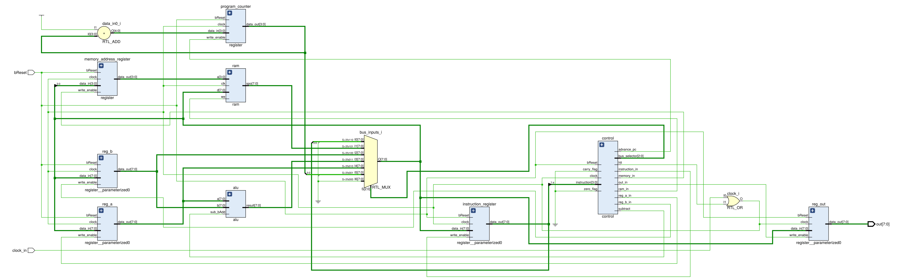

# Verilog Implementation of Ben Eater's 8-bit Breadboard Computer

## What is this madness?
This repository contains an implementation, in Verilog, of [Ben Eater's 8-bit computer on a breadboard](https://eater.net/8bit) project.

## What's in this repo?
The Verilog in this repo tries to follow closely the schematics for the original, breadboard, project

With that said, moving from breadboards to verilog did require a few changes:

* The Bus doesn't use tri-state logic. Instead, a demultiplexer is used to select which source drives the bus.
* The project uses Xilinx's RAM IP. As the writes there are clocked, the logic is somewhat different.
  * The program is loaded into memory using a `COE` file. No "run time" setting of the memory is possible.
* An external clock is assumed. The only clock related logic is disabling it using an OR gate if the HLT signal is high.

Most of the changes are in the control logic:
* Since we're not bound by external ICs, all control signals are active high. No inverters needed.
* Due to the changes to the bus, the control circuit sets a 3 bit bus source number (defined in `control.vh`) rather than discreate signals.
* Direct logic is employed to set the microcode. It is not stored in an EEPROM.
  * All this really does is move the code from the Arduino flasher to the logic itself. The end result uses LUTs, which are not fundementally
    different than an EEPROM.
* The microcode resets the step counter when the instruction is done. This means that different instructions take a different number of cycles.
